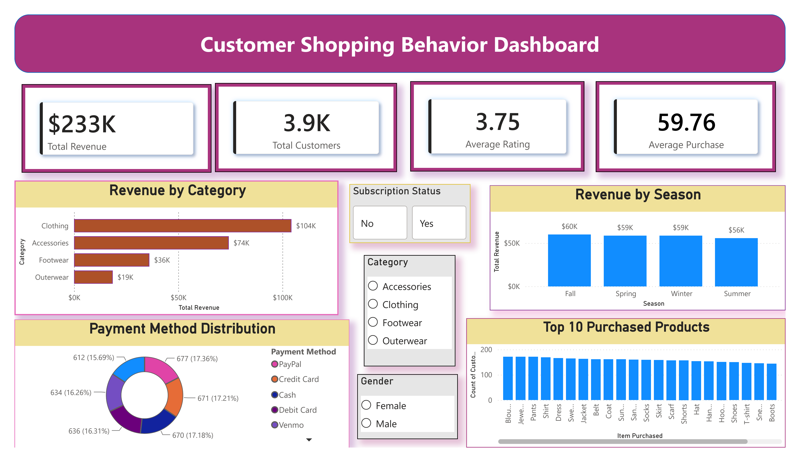

# 🛍️ Customer Shopping Behavior Analysis

An **End-to-End Data Analytics Project** that analyzes customer shopping behavior using **Python, SQL, and Power BI**. This project demonstrates the complete analytics workflow—from raw data cleaning and exploratory data analysis to SQL business analysis and an interactive Power BI dashboard.

---

# 📊 Dashboard Preview



---

# 🎯 Project Highlights

- ✅ Built a complete end-to-end Data Analytics project.
- ✅ Cleaned and analyzed **3,900 customer shopping records**.
- ✅ Performed Exploratory Data Analysis (EDA) using Python.
- ✅ Wrote **20 SQL business queries** using MySQL.
- ✅ Created an interactive Power BI dashboard with KPI cards, charts, and slicers.
- ✅ Used Git and GitHub for version control and project publishing.

---

# 📂 Dataset

- **Source:** Kaggle
- **Records:** 3,900 customer transactions
- **Features:** 18 columns
- **Includes:**
  - Customer Demographics
  - Product Categories
  - Purchase Amount
  - Payment Method
  - Shipping Type
  - Subscription Status
  - Review Ratings
  - Purchase Frequency

---

# 🛠️ Tools & Technologies

| Tool | Purpose |
|------|---------|
| Python | Data Cleaning & Analysis |
| Pandas | Data Manipulation |
| NumPy | Numerical Operations |
| Matplotlib | Data Visualization |
| Jupyter Notebook | Analysis Environment |
| MySQL | SQL Business Analysis |
| Power BI | Dashboard Development |
| DAX | KPI Measures |
| Git | Version Control |
| GitHub | Project Hosting |

---

# 📁 Project Structure

```text
Customer-Shopping-Behavior-Analysis
│
├── dashboard
│   └── Customer_Shopping_Behavior_Dashboard.pbix
│
├── data
│   ├── customer_shopping_behavior.csv
│   └── customer_shopping_behavior_cleaned.csv
│
├── images
│   └── dashboard.png
│
├── notebooks
│   └── customer_analysis.ipynb
│
├── sql
│   └── customer_analysis.sql
│
├── README.md
├── requirements.txt
└── .gitignore
```

---

# 🔄 Project Workflow

```text
Raw Dataset
      │
      ▼
Data Cleaning (Python)
      │
      ▼
Exploratory Data Analysis (EDA)
      │
      ▼
SQL Business Analysis
      │
      ▼
Power BI Dashboard
      │
      ▼
Business Insights
```

---

# 🧹 Data Cleaning

The dataset was cleaned using Python by:

- Handling missing values
- Checking duplicate records
- Verifying data types
- Preparing data for SQL and Power BI
- Exporting a cleaned dataset

---

# 📈 Exploratory Data Analysis (EDA)

Performed analysis to understand:

- Customer demographics
- Revenue trends
- Category-wise sales
- Seasonal performance
- Payment methods
- Customer ratings
- Purchase behavior

---

# 🗄️ SQL Business Analysis

A total of **20 SQL business queries** were written to answer important business questions.

### Examples:

- Total Revenue
- Total Customers
- Average Purchase Amount
- Revenue by Category
- Revenue by Season
- Revenue by Gender
- Top Revenue Locations
- Most Purchased Products
- Payment Method Analysis
- Subscription Analysis
- Shipping Method Analysis

---

# 📊 Power BI Dashboard

The interactive dashboard includes:

### KPI Cards

- 💰 Total Revenue
- 👥 Total Customers
- 💵 Average Purchase Amount
- ⭐ Average Review Rating

### Visualizations

- Revenue by Category
- Revenue by Season
- Payment Method Distribution
- Top Purchased Products

### Interactive Filters

- Category
- Gender
- Subscription Status

---

# 💡 Key Business Insights

- Clothing generated the highest revenue.
- Seasonal purchasing patterns impact sales performance.
- Customer payment preferences vary across transactions.
- A few products contribute significantly to total purchases.
- Interactive filters enable detailed business exploration.

---

# 🚀 Skills Demonstrated

- Data Cleaning
- Data Preprocessing
- Exploratory Data Analysis (EDA)
- Python Programming
- SQL (MySQL)
- Power BI Dashboard Development
- DAX Measures
- Data Visualization
- Business Intelligence
- Git & GitHub

---

# ▶️ How to Run

### 1. Clone the repository

```bash
git clone https://github.com/prashanth9618781/Customer-Shopping-Behavior-Analysis.git
```

### 2. Open the Jupyter Notebook

```text
notebooks/customer_analysis.ipynb
```

### 3. Open the Power BI Dashboard

```text
dashboard/Customer_Shopping_Behavior_Dashboard.pbix
```

using **Power BI Desktop**.

---

# 📌 Future Improvements

- Customer Segmentation Analysis
- Predictive Sales Forecasting
- Interactive Web Dashboard
- Machine Learning Models
- Additional Business KPIs

---

# 👨‍💻 Author

## Prashanth

Aspiring Data Analyst with hands-on experience in:

- Python
- SQL
- Power BI
- Data Visualization
- Business Intelligence

Passionate about transforming raw data into actionable business insights through analytics and interactive dashboards.

### GitHub

https://github.com/prashanth9618781

---

## ⭐ If you found this project helpful, consider giving it a star!
